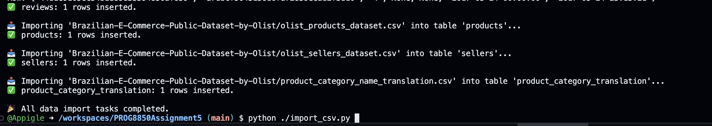
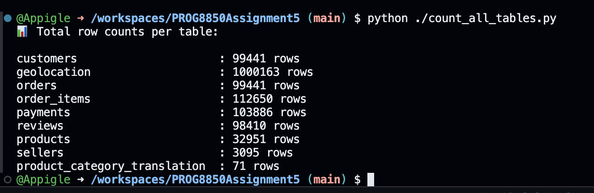
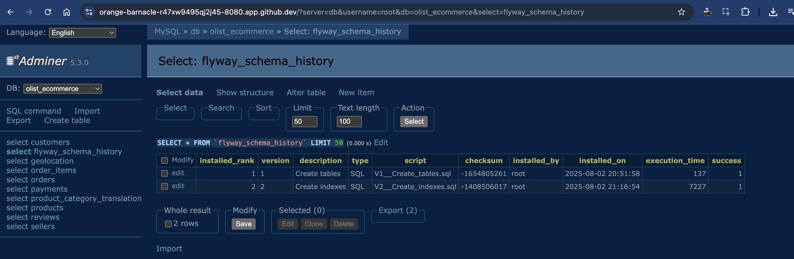
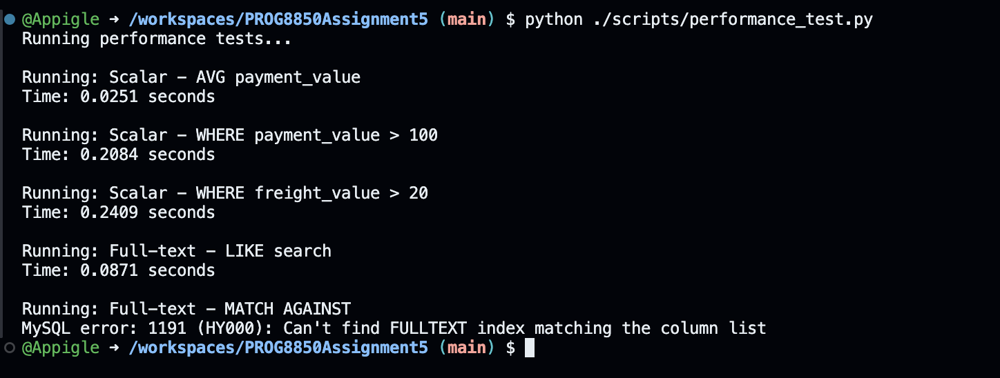
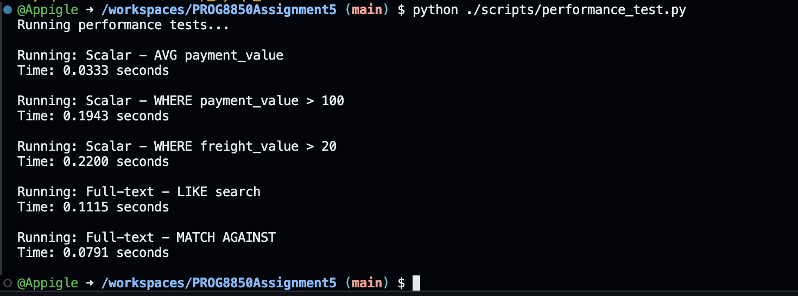

## Explanation of Searches, Goals, and Outcomes of Indexing




### Scalar Field Searches

Queries like:
```sql
SELECT * FROM payments WHERE payment_value > 100;
SELECT AVG(payment_value) FROM payments;
````

were used to test performance on numeric fields. 

**Goal**: Improve read performance on frequently queried numeric columns.

**Outcome**:
After adding B-tree indexes (`idx_payment_value`, `idx_freight_value`), MySQL switched from full table scans (`type: ALL`) to indexed range scans (`type: range`). This reduced the number of rows scanned and slightly improved performance, especially noticeable as datasets grow larger.

---

### Full-Text Search

Queries tested:

```sql
SELECT * FROM reviews WHERE review_comment_message LIKE '%atraso%';
SELECT * FROM reviews WHERE MATCH(review_comment_message) AGAINST('atraso entrega');
```

The first uses a `LIKE` pattern match — flexible but slow and unindexed. The second uses MySQL's full-text search, which requires a `FULLTEXT` index.

**Goal**: Enable fast text searching for support queries.

**Outcome**:
Before indexing, `MATCH ... AGAINST` failed. After adding the full-text index, it became the fastest search method, outperforming `LIKE` in both speed and scalability.


---

### Summary

Indexing improved query execution by:

* Reducing scan types from `ALL` to `range` or `fulltext`
* Allowing MySQL to locate rows faster using index trees
* Enabling advanced features like full-text ranking (with MATCH)
